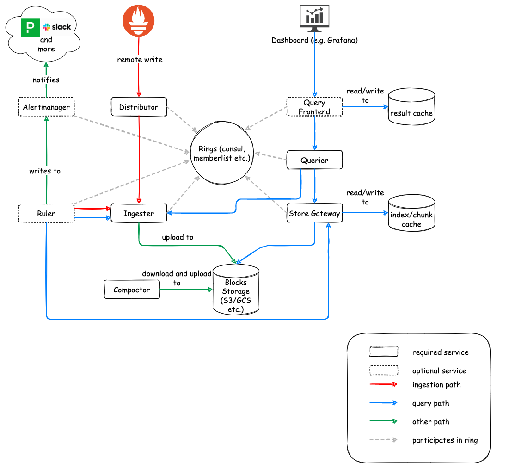
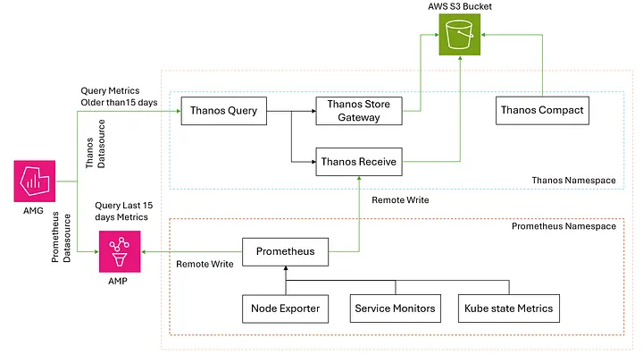

# 🛰️ Kosmos Observability Stack

This repository defines our end-to-end observability architecture using **Prometheus**, **Thanos**, **AWS S3**, and visualization tools like **Grafana (AMG)**.

---

## 🖼️ Architecture Overview

### 1. **Internal Flow with Loki/Cortex-style Stack**

This diagram illustrates our observability stack’s internal flow:

- **Prometheus** scrapes Kubernetes workloads metrics.
- **Promtail or Filebeat** identified and collects Kubernetes workloads logs.
- **Distributor and Ingester** accept remote writes and forward them for short-term in-memory retention.
- **Store Gateway + Object Storage** enable long-term logs and metric retention and querying.
- **Ruler** and **Alertmanager** manage alert evaluation and delivery.
- **Query Frontend + Grafana** enable fast, cache-optimized queries across both short-term and long-term data.

---

### 2. **Production Thanos + AWS S3 Setup**

This architecture shows how **Thanos integrates with Prometheus and AWS S3** for durable, long-term metric storage and query federation:

- **Prometheus** scrapes metrics from:
  - `Node Exporter`
  - `Service Monitors`
  - `Kube State Metrics`
- It then sends data via `remote_write` to **Thanos Receive**
- **Thanos Receive** pushes metrics to **AWS S3**, which is the central **object storage backend**
- **Thanos Store Gateway** and **Thanos Query** pull data from S3 to support queries
- **Thanos Compact** periodically compacts metric blocks stored in S3
- Grafana (AMG) connects to:
  - **Prometheus Datasource** for recent metrics (<15d)
  - **Thanos Datasource** for long-term queries (>15d)

---

## 📦 Components

| Component      | Role                                            |
| -------------- | ----------------------------------------------- |
| Prometheus     | Scrapes metrics and writes to Thanos            |
| Thanos Receive | Accepts remote_write and uploads to S3          |
| Thanos Store   | Makes S3 blocks queryable                       |
| Thanos Query   | Merges data from Store + Receive for Grafana    |
| Thanos Compact | Compacts and deduplicates blocks in S3          |
| Grafana (AMG)  | Unified dashboard visualization for all metrics |

---

## ☁️ AWS S3 Integration

Metrics older than 15 days are offloaded to **Amazon S3** for scalable and cost-effective storage. Thanos Store Gateway and Compactor continuously manage and optimize this data.

---

## 📊 Query Routing in Grafana

- For real-time analysis (<15 days): queries are routed to **Prometheus**
- For historical data (>15 days): queries are routed to **Thanos Query**

---
